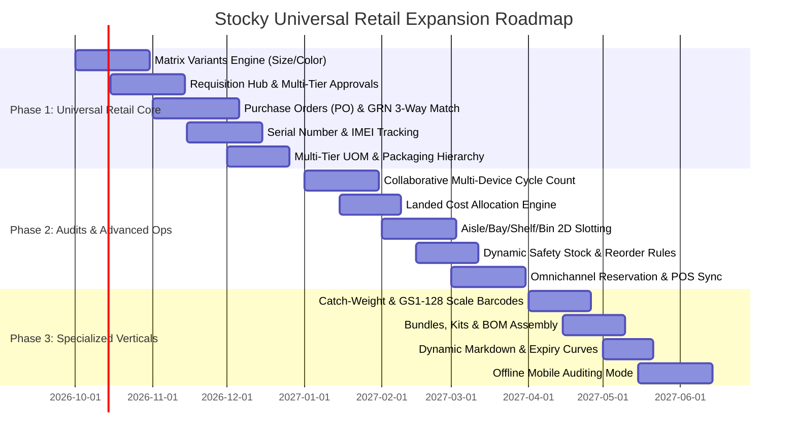

# Stocky Product Backlog & Competitive Feature Analysis
## Strategic Expansion from F&B Perishables to Multi-Industry Retail Inventory

**Document Version**: v1.0.0  
**Status**: Approved for Roadmap Planning  
**Target Industries**: GICS Consumer Staples, Consumer Discretionary & Healthcare Retailing  
**Competitive Benchmark**: Daftra ERP, Zoho Inventory, Katana Cloud Inventory, Odoo ERP, Shopify POS / POS Pro  

---

## Executive Summary & Competitive Assessment

Stocky was originally engineered with Food & Beverage (F&B) operations at its core, focusing on batch numbers, manufacturing/expiry dates, First-Expired-First-Out (FEFO) alerts, and store-level stock tasks. 

Through our audit of **Stocky's codebase** alongside competitive analysis of **Daftra ERP** (a market-leading regional ERP across MENA) and best-in-class international retail inventory systems, this backlog charts the transformation of Stocky into a universal, enterprise-grade inventory and audit platform. This roadmap addresses key retail verticals defined by the **Global Industry Classification Standard (GICS)**:

1. **Food & Staples Retailing** (Supermarkets, Grocers, Convenience, Specialty Food)
2. **Apparel, Footwear & Luxury Goods** (Fashion, Department Stores, Footwear)
3. **Consumer Electronics, Appliances & High-Value Retail** (Computers, Mobile Phones, Consumer Tech)
4. **Home Improvement, Hardware, Building Materials & Furniture** (DIY, Lumber, Home Goods)
5. **Specialty Retail: Cosmetics, Beauty & Fragrances** (Cosmetics, Skincare, Personal Care)
6. **Automotive Aftermarket & Spare Parts Retailing** (Auto Parts, Tires, Hardware)
7. **Healthcare & Pharmacy Retailing** (Pharmacies, Medical Supplies, OTC/Rx)

---

## Current Architecture Audit: Stocky vs. Daftra ERP

| Functional Area | Stocky Current State (v0.1.0) | Daftra ERP Capability | Strategic Opportunity for Stocky |
| :--- | :--- | :--- | :--- |
| **Requisition Management** | Simple `SupplierRequest` model (replenish/return/replace) without multi-tier approval hierarchy. | Full Internal Material Requisitions (أذون صرف) + Purchase Requests (طلبات شراء) with manager approvals. | Implement a unified **Requisition Hub** allowing store staff to request stock from Central Warehouse or Procurement with multi-step approval workflows. |
| **Procurement (P2P)** | Stock received directly via drawer (`ReceiveStockCommand`). No PO entity. | Complete P2P: PR ➔ RFQ ➔ PO ➔ Goods Receipt Note (GRN) ➔ Supplier Bill ➔ 3-Way Matching. | Introduce lightweight yet robust **Purchase Orders (PO)** and **Goods Receipt Notes (GRN)** with partial receipt tracking and variance flags. |
| **Landed Costs** | Only static `unitCost` on lot/product. | Allocates shipping, customs, insurance across received lines by quantity, weight, or value. | Enable true **Landed Cost Allocation** to calculate exact gross margins per SKU. |
| **Tracking Dimensions** | Batch number + Expiration date (`StockLot`). | Batch/Lot, Expiry Date, Serial Numbers (discrete unit tracking). | Add **Serial Number / IMEI Tracking** and **Matrix Variants (Size/Color)** to unlock Electronics and Apparel. |
| **Units of Measure (UOM)** | Single flat `unitName` string per item. | Multi-UOM hierarchy with conversion ratios (e.g. 1 Pallet = 10 Cartons = 240 Units). | Build a hierarchical **Multi-Tier UOM Engine** with automatic carton breakdown and unit-level auditing. |
| **Stock Audits & Stocktaking** | `StockCountSession` + `StockTask` (blind/expected items counted, single-session). | Full warehouse count vs. Periodic/Cycle counts by category/brand; automatic discrepancy adjustments. | Deliver modern **Collaborative Mobile Audits** (multiple staff scanning simultaneously with live conflict resolution & ABC cycle counting). |
| **Transfers & Logistics** | `InventoryTransfer` (requested ➔ approved ➔ in_transit ➔ received). | Direct transfer & 2-step in-transit transfer with transit loss accounting. | Enhance transfers with **Transfer Packing Slips, QR Manifests, and Transit Discrepancy Claims**. |
| **Retail & POS Sync** | Standalone inventory without POS event hooks. | Integrated POS Cashier shifts, Z-reports, sales decrement, offline register caching. | Provide **Real-Time POS & E-Commerce Webhooks / Reservation Locks** (BOPIS, Click & Collect). |

---

## Prioritization Methodology: RICE Scoring

Each feature in this backlog is evaluated using the **RICE** framework:
- **Reach (R)**: Estimated % of customer organizations / users impacted monthly (1 to 10 scale).
- **Impact (I)**: Impact on business value, sales velocity, or operational efficiency (3 = Massive, 2 = High, 1 = Medium, 0.5 = Low).
- **Confidence (C)**: Product & engineering confidence in requirements and market need (1.0 = High, 0.8 = Medium, 0.5 = Low).
- **Effort (E)**: Estimated engineering sprints / weeks (1 = 1-2 weeks, 2 = 3-4 weeks, 3 = 5-8 weeks, 4 = 8+ weeks).
- **RICE Score** = $\frac{\text{Reach} \times \text{Impact} \times \text{Confidence}}{\text{Effort}}$

---

# Comprehensive Prioritized Backlog (Highest to Lowest Impact)

## Tier 1: Core Critical Platform Expansion (RICE Score: 8.0 - 10.0)
*Fundamental platform capabilities required to expand beyond F&B into apparel, electronics, grocery, and multi-store retail.*

### 1. Matrix Variants Engine (Parent-Child SKU: Size × Color × Style × Material)
- **RICE Score**: **9.6** (Reach: 9.5 | Impact: 3.0 | Confidence: 1.0 | Effort: 3)
- **Target GICS Sectors**: Apparel, Footwear, Luxury Goods, Sporting Goods, Home Textiles.
- **Problem Statement**: Retailers selling fashion or footwear cannot manage items as flat single SKUs. A single sneaker design exists in 8 sizes and 4 colorways (32 variants). Forcing 32 separate products clutters the catalog, makes purchasing impossible, and breaks audit workflows.
- **Feature Specification**:
  - `ProductParent` entity containing shared brand, season, department, tax class, description, and base image gallery.
  - Dynamic attribute generator (Size, Color, Width, Flavor, Finish) generating child `ProductVariant` records with unique SKUs, Barcodes, and prices.
  - Multi-dimensional matrix input UI for stock receiving, purchase orders, and transfer orders (e.g. grid of Sizes along X-axis, Colors along Y-axis).
  - Bulk variant editing: update retail price or reorder threshold across all sizes in one click.

### 2. End-to-End Requisition Management & Approval Workflows (Store ➔ HQ / DC)
- **RICE Score**: **9.0** (Reach: 9.0 | Impact: 3.0 | Confidence: 1.0 | Effort: 3)
- **Target GICS Sectors**: All Multi-Branch Retailers (Grocery, Pharmacy, Electronics, Fashion).
- **Problem Statement**: Store managers currently have no structured way to submit internal store replenishment requests. Requests happen over WhatsApp or phone calls, resulting in lost records, unauthorized stock transfers, and stockouts.
- **Feature Specification**:
  - Two distinct requisition types:
    1. **Store Replenishment Request**: Branch requests stock from Central Warehouse or Hub.
    2. **Direct Purchase Requisition (PR)**: Branch requests procurement team to order non-stocked goods from external vendors.
  - Multi-tiered configurable approval matrices (Store Manager ➔ Area Manager ➔ Warehouse Operations / Finance).
  - Automated fulfillment routing: system evaluates if Central Warehouse has sufficient stock; if yes, converts requisition into a `TransferOrder`; if no, flags for procurement consolidation into a `PurchaseOrder`.
  - In-app interactive approval cards with full line-item modification capabilities (approve full, approve partial, substitute item).

### 3. Formal Purchase Orders (PO) & Goods Receipt Notes (GRN) with 3-Way Matching
- **RICE Score**: **8.8** (Reach: 9.0 | Impact: 3.0 | Confidence: 0.95 | Effort: 3)
- **Target GICS Sectors**: All Retail Sectors.
- **Problem Statement**: Stocky currently receives stock via a direct drawer without a preceding order commitment. Retailers cannot track on-order inventory, vendor fulfillment lead times, backorders, or pricing discrepancies between agreed purchase quotes and delivered bills.
- **Feature Specification**:
  - `PurchaseOrder` lifecycle: `Draft` ➔ `Pending Approval` ➔ `Issued / Sent to Supplier` ➔ `Partially Received` ➔ `Fully Received` ➔ `Billed` ➔ `Closed`.
  - `GoodsReceiptNote (GRN)`: Warehouse receiving interface with barcode validation against PO lines.
  - Strict partial delivery and backorder management (track outstanding balances and expected delivery dates).
  - Over-delivery protection (configurable tolerance percentage or strict blocking).
  - 3-Way Match validation (PO Quantity & Unit Price vs. GRN Received Quantity vs. Supplier Invoice Amount) with discrepancy alert flags.

### 4. Serial Number & IMEI Tracking (Unit-Level Lifecycle Management)
- **RICE Score**: **8.4** (Reach: 7.0 | Impact: 3.0 | Confidence: 1.0 | Effort: 2.5)
- **Target GICS Sectors**: Consumer Electronics, Mobile Phone Retailing, Home Appliances, Luxury Watches & Jewelry, Power Tools.
- **Problem Statement**: High-value products cannot be tracked in bulk lots. Each smartphone, laptop, or luxury watch has a unique Serial Number or IMEI that must be tracked individually for warranty validation, counterfeit prevention, loss tracking, and returns.
- **Feature Specification**:
  - Track unit status: `In Stock`, `Reserved`, `Sold`, `In Transit`, `RMA Under Repair`, `Returned Defective`, `Scrapped`.
  - High-speed barcode/camera serial number scanner with batch OCR scan (scan 20 serial numbers on a master carton in 10 seconds).
  - Complete historical provenance lookup: search any Serial/IMEI to see supplier PO, receiving date, branch location, transfer history, sales invoice, and customer warranty expiry.
  - Serialized stock counting: during audit, verify exact serial numbers present on shelf against expected serial register.

### 5. Multi-Tier Unit of Measure (UOM) Engine & Packaging Hierarchies
- **RICE Score**: **8.2** (Reach: 8.5 | Impact: 2.5 | Confidence: 0.95 | Effort: 2.5)
- **Target GICS Sectors**: Food & Staples Retailing, Hardware, Building Supplies, Beverage Distribution.
- **Problem Statement**: Products are purchased by the Pallet or Master Carton from manufacturers, transferred to stores by the Outer Case, and sold to consumers as individual Units or Packs. A flat unit system breaks inventory counts and forces manual mental math.
- **Feature Specification**:
  - Flexible packaging hierarchy definition per product:  
    `1 Pallet = 40 Master Cartons = 480 Inner Packs = 5,760 Individual Units`.
  - Barcode mapping per packaging level (individual unit barcode, carton ITF-14 barcode, pallet GS1-128 barcode).
  - Automatic carton breakdown / de-kitting: selling or transferring an inner pack automatically unpacks a master carton in inventory.
  - Dual-UOM reporting: view stock balances as `"12 Cartons + 4 Units"` or `"292 Units"`.

### 6. Advanced Collaborative Auditing & Automated ABC Cycle Counting
- **RICE Score**: **8.0** (Reach: 8.5 | Impact: 3.0 | Confidence: 0.95 | Effort: 3)
- **Target GICS Sectors**: All Retail Sectors (Crucial for large footprint stores and multi-lane supermarkets).
- **Problem Statement**: Current auditing is single-user and lacks systematic cycle counting schedules. Large retail stores cannot close for a full store audit; they need continuous, rolling cycle counts without stopping business.
- **Feature Specification**:
  - **Automated ABC Classification Generator**: automatically grades SKUs based on Pareto principle (80/20 rule: high revenue/high velocity = Class A, moderate = Class B, slow moving = Class C).
  - Configurable audit scheduling: Class A counted every 7 days, Class B every 30 days, Class C every 90 days.
  - **Multi-Device Real-Time Collaborative Auditing**: multiple store associates scan different aisles simultaneously using their mobile phones; live tallying prevents duplicate counts with WebSocket synchronization.
  - **Blind Count Mode**: hides expected book balance from auditors to eliminate confirmation bias and forced falsification.
  - One-click discrepancy resolution: generates formal Stock Adjustment Vouchers (Surplus vs. Shrinkage) with mandatory managerial approval and reason codes (theft, spoilage, damaged packaging, misplacement).

---

## Tier 2: High-Impact Retail Operations & Supply Chain (RICE Score: 6.0 - 7.9)
*Operational tools that eliminate cost leaks, streamline supplier relations, and optimize warehouse floor logistics.*

### 7. Landed Cost Accounting & Multi-Currency Procurement
- **RICE Score**: **7.5** (Reach: 7.5 | Impact: 2.5 | Confidence: 0.9 | Effort: 2.5)
- **Target GICS Sectors**: All Import & Wholesale Retailers (Electronics, Apparel, Furniture, Specialty Food).
- **Problem Statement**: Retailers importing goods incur freight, customs tariffs, shipping insurance, port clearance, and inland trucking. Assigning only supplier invoice cost distorts margin analysis and leads to underpriced retail merchandise.
- **Feature Specification**:
  - Multi-currency purchase orders with real-time or fixed exchange rate capture.
  - Landed Cost Allocation Wizard: apportion freight/customs bills across PO items by Value, Quantity, Weight, or Volume ($CBM$).
  - Dynamic Cost of Goods Sold (COGS) recalculation updating the true moving average unit cost.

### 8. Warehouse Location Hierarchy (Aisle / Bay / Shelf / Bin 2D Slotting)
- **RICE Score**: **7.2** (Reach: 7.0 | Impact: 2.5 | Confidence: 0.95 | Effort: 2.5)
- **Target GICS Sectors**: Large Supermarkets, Department Stores, Hardware & Home Improvement, Central Distribution Hubs.
- **Problem Statement**: Warehouse staff spend hours wandering aisles looking for stock. Items are misplaced, leading to phantom stockouts where system says item exists but staff cannot find it.
- **Feature Specification**:
  - Hierarchical location modeling: `Warehouse ➔ Zone ➔ Aisle ➔ Bay ➔ Shelf ➔ Bin`.
  - Bin barcode labeling: staff scan the bin barcode to confirm item put-away and pick actions.
  - Guided pick & audit path optimization: generates a sequential routing path through the warehouse aisles to minimize walking time during audits and order picking.
  - Capacity & dimension limits: alerts if bin volume or maximum weight threshold is exceeded.

### 9. Dynamic Reorder Points & Predictive Safety Stock
- **RICE Score**: **6.9** (Reach: 8.0 | Impact: 2.0 | Confidence: 0.9 | Effort: 2.3)
- **Target GICS Sectors**: FMCG, Grocery, Convenience Stores, Pharmacy, Fast Fashion.
- **Problem Statement**: Static reorder points fail when demand fluctuates or supplier lead times vary. Retailers either stock out during seasonal surges or tie up working capital in excess dead inventory.
- **Feature Specification**:
  - Dynamic safety stock calculation based on average daily sales velocity ($V_d$) and supplier lead time in days ($L$):  
    $$\text{Reorder Point} = (V_d \times L) + \text{Safety Stock}$$
  - Seasonal velocity multipliers and promotional surge adjustments.
  - Auto-generated Draft Purchase Orders when stock reaches reorder point, grouped by primary vendor for bulk ordering discounts.

### 10. Omnichannel Stock Reservation & Real-Time POS Sync Gateway
- **RICE Score**: **6.7** (Reach: 8.0 | Impact: 2.5 | Confidence: 0.85 | Effort: 3)
- **Target GICS Sectors**: Omnichannel Retailers (Shopify, WooCommerce, Salla, Zid, Custom POS).
- **Problem Statement**: When items sell in physical stores or online, inventory lags cause overselling and cancellations. Conversely, click-and-collect orders placed online are accidentally sold to walk-in customers before staff can pick them.
- **Feature Specification**:
  - Two-state stock allocation: `On Hand Quantity` vs `Available to Promise (ATP)` vs `Reserved Quantity`.
  - BOPIS (Buy Online, Pick Up In Store) picking queue: notifies store staff on mobile to pick and bag customer web orders.
  - Real-time bi-directional inventory sync API and webhooks (< 500ms sync) with POS registers and e-commerce platforms.

### 11. Batch Recall, Quarantine & Traceability Command Center
- **RICE Score**: **6.4** (Reach: 6.5 | Impact: 3.0 | Confidence: 1.0 | Effort: 3)
- **Target GICS Sectors**: Food & Beverage, Grocery, Cosmetics, Pharmaceutical Retail.
- **Problem Statement**: When a manufacturer issues a health safety recall on a contaminated batch, retailers must immediately find and lock every unit across 50 branches. Doing this manually takes days and risks massive regulatory fines.
- **Feature Specification**:
  - One-Click Recall Command: entering a manufacturer Lot/Batch number immediately freezes all matching stock across all branches and warehouses.
  - Automatic POS sale block: cashiers cannot scan or sell recalled batch numbers.
  - Quarantine relocation transfer: guides warehouse staff to pull recalled items off shelves and stage them in a designated quarantine location for vendor return or destruction.
  - Audit audit log with timestamped evidence for health and safety authorities.

### 12. Supplier Price Lists, Contracts & Performance Scorecard
- **RICE Score**: **6.1** (Reach: 7.0 | Impact: 2.0 | Confidence: 0.9 | Effort: 2.2)
- **Target GICS Sectors**: All Retailers.
- **Problem Statement**: Retailers deal with hundreds of vendors with fluctuating terms, volume discount tiers, and frequent delivery delays.
- **Feature Specification**:
  - Contracted supplier price lists with validity date ranges and quantity break discounts (e.g. 1-99 units @ \$10, 100+ units @ \$8.50).
  - Supplier Lead Time tracking: measures actual delivery delay vs promised delivery date across every PO.
  - Fulfillment accuracy scoring: tracks % of orders delivered with shortages, damaged goods, or invoice discrepancies.
  - Supplier statement of account and aging reports (30/60/90 days payable balances).

---

## Tier 3: Specialized Industry & Advanced Retail Enablers (RICE Score: 4.5 - 5.9)
*Industry-specific capabilities that unlock high-value enterprise niches.*

### 13. Bundles, Kits & Light Assembly (Bill of Materials - BOM)
- **RICE Score**: **5.8** (Reach: 6.0 | Impact: 2.5 | Confidence: 0.9 | Effort: 2.5)
- **Target GICS Sectors**: Cosmetics (Gift Sets), Electronics (Camera Bundles), Home Improvement (Assembly Furniture), Grocery (Hampers).
- **Feature Specification**:
  - Non-stocked virtual bundles (dynamically deducts component SKUs at time of sale).
  - Pre-assembled physical kits: manufacturing work order converts raw components into a finished bundle with allocated packaging cost.
  - Disassembly / De-kitting: returns components back to active stock when a promotional gift basket is disassembled.

### 14. Variable-Weight Scale & GS1-128 Barcode Parser
- **RICE Score**: **5.5** (Reach: 5.5 | Impact: 2.5 | Confidence: 0.95 | Effort: 2.4)
- **Target GICS Sectors**: Grocery, Delis, Butchery, Fresh Produce, Cheese & Bulk Foods.
- **Feature Specification**:
  - Direct parsing of embedded barcode standards:
    - EAN-13 / UPC-A Price & Weight embedded barcodes (Prefix `20` / `21` / `02` + Item Code + Price/Weight Checksum).
    - GS1 DataBar & GS1-128: parsing Application Identifiers (AI `01` GTIN, `10` Batch, `17` Expiry Date, `21` Serial Number, `310x` Net Weight in kg).
  - Scale calibration & catch-weight inventory reconciliation.

### 15. Dynamic Markdown & Clearance Expiry Curve
- **RICE Score**: **5.2** (Reach: 6.5 | Impact: 2.0 | Confidence: 0.85 | Effort: 2.2)
- **Target GICS Sectors**: Supermarkets, Fresh Foods, Bakeries, Fast Fashion.
- **Feature Specification**:
  - Automated clearance discounting rules: items within 7 days of expiry auto-discounted by 25%; within 3 days auto-discounted by 50%.
  - Generates instant markdown barcode stickers with discounted pricing.
  - End-of-season markdown cadence for apparel (gradual percentage drops to liquidate stock prior to new seasonal delivery).

### 16. Mobile Offline Audit Engine (IndexedDB / SQLite Local Sync)
- **RICE Score**: **5.0** (Reach: 6.0 | Impact: 2.5 | Confidence: 0.8 | Effort: 3)
- **Target GICS Sectors**: Large Warehouses, Basement Stockrooms, Rural Branches with unreliable Wi-Fi.
- **Feature Specification**:
  - Local browser/app database caching entire branch catalog (up to 50,000 SKUs).
  - Full scanning and counting capabilities completely disconnected from network.
  - Background delta sync with three-way merge and conflict resolution when connection is restored.

### 17. Consignment Inventory & Vendor-Managed Inventory (VMI)
- **RICE Score**: **4.8** (Reach: 4.5 | Impact: 2.5 | Confidence: 0.9 | Effort: 2.3)
- **Target GICS Sectors**: Department Stores, Bookstores, Luxury Consignment, Supermarket Concessions.
- **Feature Specification**:
  - Stock segregated as "Consignment" (physically in store, but legally owned by vendor until sold).
  - Self-billing vendor settlement reports generated upon POS sales event.
  - Vendor portal view: suppliers log in to view their live on-shelf stock levels and trigger automated replenishment shipments.

### 18. Handheld RFID Mass Auditing Integration
- **RICE Score**: **4.6** (Reach: 4.0 | Impact: 3.0 | Confidence: 0.8 | Effort: 2.6)
- **Target GICS Sectors**: High-End Apparel, Footwear, Jewelry, Luxury Retail.
- **Feature Specification**:
  - Bluetooth integration with handheld RFID wand scanners (Zebra, Honeywell).
  - Non-line-of-sight mass scanning: read 500 apparel tags in a rack in 15 seconds.
  - Discrepancy audio radar: wand beeps faster as auditor approaches a missing tagged garment.

---

## Tier 4: Enterprise Intelligence & Deep Vertical Specialization (RICE Score: 3.0 - 4.4)
*Specialized enterprise features for niche regulated verticals and advanced loss prevention.*

### 19. Returns Merchandise Authorization (RMA) & Graded Stock (A/B/C Grade)
- **RICE Score**: **4.2** (Reach: 4.5 | Impact: 2.0 | Confidence: 0.9 | Effort: 2.1)
- **Target GICS Sectors**: Electronics, Home Appliances, Footwear, E-commerce Fulfillment.
- **Feature Specification**:
  - Customer return triage inspection workflow: `Unopened / Restock`, `Refurbish Required`, `Grade A Open-Box`, `Grade B Cosmetic Scratch`, `Damaged / Scrapped`.
  - Automatic discount pricing and segregated inventory tracking for refurbished/graded items.

### 20. Automotive Parts Fitment & OEM Cross-Referencing Matrix
- **RICE Score**: **3.8** (Reach: 3.0 | Impact: 3.0 | Confidence: 0.85 | Effort: 2.4)
- **Target GICS Sectors**: Automotive Aftermarket, Spare Parts, Tire & Battery Retailers.
- **Feature Specification**:
  - ACES & PIES automotive standard compliance: link parts to Vehicle Identification (Year, Make, Model, Trim, Engine).
  - Inter-brand OEM cross-reference table (e.g. Bosch part # corresponds to Denso part # and Toyota OEM part #).
  - Core deposit tracking: old core returned by customer generates cash/account credit and tracks reverse core return to remanufacturer.

### 21. Regulated Pharmacy & Controlled Substance Perpetual Vault
- **RICE Score**: **3.5** (Reach: 3.0 | Impact: 3.0 | Confidence: 0.9 | Effort: 2.5)
- **Target GICS Sectors**: Hospital Pharmacies, Prescription Retail, Veterinary Supplies.
- **Feature Specification**:
  - NDC (National Drug Code) directory integration.
  - Controlled substance perpetual digital ledger with tamper-evident cryptographic log.
  - Dual-pharmacist sign-off authentication for schedule II/controlled substance stock adjustments.

### 22. AI Loss Prevention & Shrinkage Anomaly Detection
- **RICE Score**: **3.2** (Reach: 5.0 | Impact: 2.0 | Confidence: 0.7 | Effort: 3)
- **Target GICS Sectors**: Supermarkets, Convenience Chains, Electronics Retailers.
- **Feature Specification**:
  - Anomaly detection algorithm flagging unexpected discrepancy spikes correlated with specific employee shifts, delivery drivers, or store aisles.
  - Shrinkage velocity heatmap identifying high-theft SKU clusters to recommend security peg locks or shelf repositioning.

---

## Roadmap Release Plan & Milestones

---

## Verification & Acceptance Criteria Framework

For every feature promoted from this backlog into active development:
1. **Model Compliance**: Must be defined in `@stocky/types` with complete TypeScript interfaces and documented relationships in `@stocky/db` (Drizzle ORM).
2. **Design System Adherence**: Must strictly adhere to `AGENT.md` (Geist font 300/400/500, no mono fonts, tokenized variables in `global.css`, 12px widget roundness, `@stocky/icons`).
3. **Multi-Platform Parity**: High-velocity frontline tasks (auditing, receiving, serial scanning, requisitions) must have companion mobile screens in `apps/mobile`.
4. **Performance Benchmark**: Table views and search bars must remain smooth at 100,000+ SKUs with virtualized rendering and debounced server queries.
